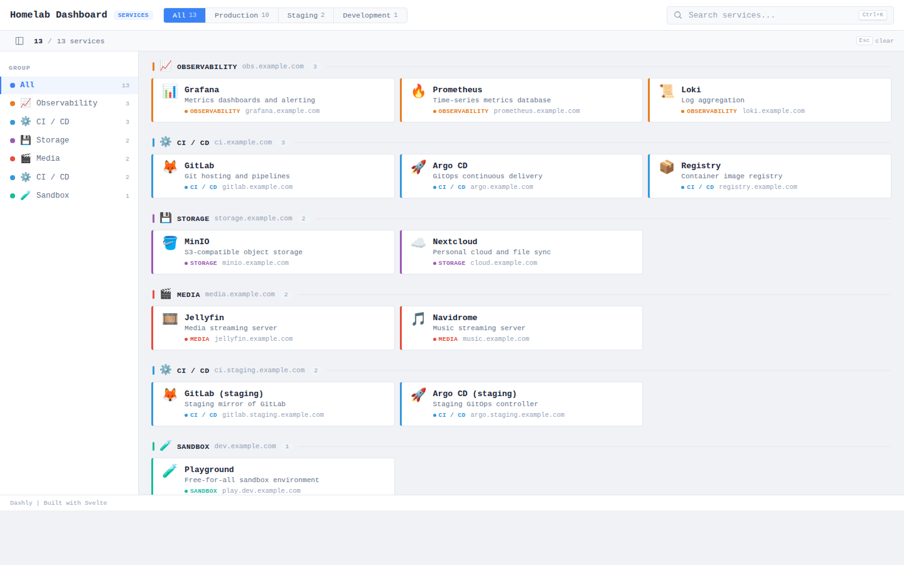

# Dashly

Lightweight, JSON-configurable link organizer with environment and group filtering. Built for non-production use.

Note: I did not google the name "Dashly", so I did not realise that there are other services with the same name.

## Features

- Environment + group filters
- Full-text search (`Ctrl+K` / `Cmd+K`)
- JSON-configured
- Runtime `custom.css` override (no rebuild)
- Docker-ready




## Configuration

Configuration is loaded from `config.json` at runtime (no rebuild needed).

### Config Schema

```json
{
  "dashboard": {
    "title": "Dashboard Title",
    "subtitle": "Subtitle text",
    "badge": "Badge",
    "footer": "Footer text",
    "groupLabel": "Group"
  },
  "environments": [
    { "id": "prod", "name": "Production" }
  ],
  "groups": [
    {
      "id": "group1",
      "name": "Group Name",
      "domain": "group.example.com",
      "color": "#3498db",
      "icon": "📊",
      "environment": "prod"
    }
  ],
  "services": [
    {
      "name": "Service Name",
      "url": "https://service.example.com",
      "description": "Service description",
      "icon": "🚦",
      "group": "group1",
      "environment": "prod"
    }
  ]
}
```

## Custom CSS

Mount a `custom.css` file to override styles at runtime (no rebuild). Loaded
after the app mounts, so it wins the cascade over the built-in Svelte styles.
If the file is absent it 404s harmlessly.

```css
/* custom.css */
body {
  background: #0b1021;
}
```

Mount it alongside `config.json` — see Docker examples below.

## Docker

### Pull from Docker Hub

```bash
docker pull rstek/dashly:latest
```

View available versions on [Docker Hub](https://hub.docker.com/r/rstek/dashly).

### Run

```bash
docker run -p 8080:80 \
  -v /path/to/config.json:/usr/share/caddy/html/config.json:ro \
  -v /path/to/custom.css:/usr/share/caddy/html/custom.css:ro \
  rstek/dashly:latest
```

### Docker Compose

```yaml
services:
  dashly:
    image: rstek/dashly:latest
    ports:
      - "8080:80"
    volumes:
      - ./config.json:/usr/share/caddy/html/config.json:ro
      - ./custom.css:/usr/share/caddy/html/custom.css:ro
```

## Development

```bash
bun install
bun run dev       # Dev server
bun run build     # Build
```

Config changes are picked up on page refresh (no cache headers on config.json).

## Acknowledgments

Developed with assistance from Claude AI.
